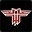

# Return to Castle Wolfenstein Server
#### [Linuxgsm](https://linuxgsm.com/servers/rtcwserver/)
  * Client Port - 27960
  * Query Port - 
  * RCON Port - 
  
#### [LGSM Config](https://github.com/GameServerManagers/LinuxGSM/tree/master/lgsm/config-default/config-lgsm/rtcwserver)
  * config-lgsm/rtcwserver/common.cfg

#### [Game Configs](https://github.com/GameServerManagers/Game-Server-Configs/tree/main/rtcw)
  * serverfiles/main/rtcwserver.cfg

#### [Icon](../icons/rtcw-icon.png)
